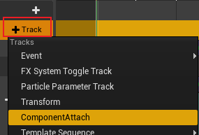
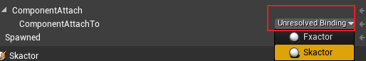
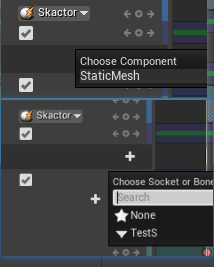
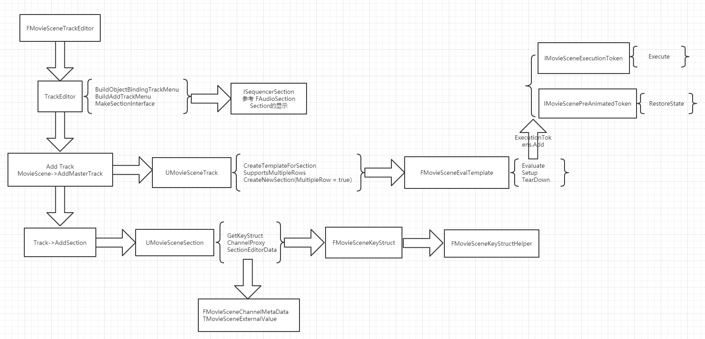

# Sequencer Component Attach To Other Track

# Overview

在 Serquencer 中将 Actor 的 Component Attach 到其他 Actor 的 Component 中

# Quick start

* 创建ComponentAttach Track.

* 绑定 Actor

* 选择 Component 和 Socket

***
# 流程图

